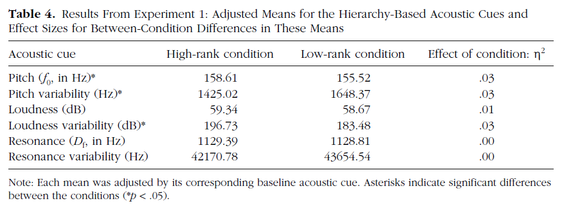

```{r}
articleID <- "1-1-2015_PS" # insert the article ID code here e.g., "10-3-2015_PS"
reportType <- 'final'
pilotNames <- "Marc B. Harrison, Gobi Dasu" # insert the pilot's name here e.g., "Tom Hardwicke". If there are multiple pilots enter both names in a character string e.g., "Tom Hardwicke, Bob Dylan"
copilotNames <- "Michèle Nuijten" # insert the co-pilot's name here e.g., "Michael Frank". If there are multiple co-pilots enter both names in a character string e.g., "Tom Hardwicke, Bob Dylan"
pilotTTC <- 120 # insert the pilot's estimated time to complete (in minutes, fine to approximate) e.g., 120
copilotTTC <- 220 # insert the co- pilot's estimated time to complete (in minutes, fine to approximate) e.g., 120
pilotStartDate <- as.Date("10/26/2017", format = "%m/%d/%y") # insert the pilot's start date in US format e.g., as.Date("01/25/18", format = "%m/%d/%y")
copilotStartDate <- as.Date("10/16/2018", format = "%m/%d/%y") # insert the co-pilot's start date in US format e.g., as.Date("01/25/18", format = "%m/%d/%y")
completionDate <- as.Date("07/22/2019", format = "%m/%d/%y") # copilot insert the date of final report completion (after any necessary rounds of author assistance) in US format e.g., as.Date("01/25/18", format = "%m/%d/%y")
```

-------

#### Methods summary: 
A sense of power has often been tied to how we perceive each other's voice. Social hierarchy is embedded into the structure of society and provides a metric by which others relate to one another. In 1956, the Brunswik Lens Model was introduced to examine how vocal cues might influence hierarchy. In "The Sound of Power: Conveying and Detecting Hierarchical Rank Through Voice," Ko and colleagues investigated how manipulation of hierarchal rank within a situation might impact vocal acoustic cues. Using the Brunswik Model, six acoustic metrics were utilized (pitch mean & variability, loudness mean & variability, and resonance mean & variability) to isolate a potential contribution between individuals of different hierarchal rank. In the first experiment, Ko, Sadler & Galinsky examined the vocal acoustic cues of individuals before and after being assigned a hierarchal rank in a sample of 161 subjects (80 male). Each of the six hierarchy acoustic cues were analyzed with a 2 (high vs. low rank condition) x 2 (male vs. female) analysis of covariance, controlling for the baseline of the respective acoustic cue.

------

#### Target outcomes: 
> The impact of hierarchical rank on speakers’ acoustic cues. Each of the six hierarchy-based (i.e., postmanipulation) acoustic variables was submitted to a 2 (condition: high rank, low rank) × 2 (speaker’s sex: female, male) between-subjects analysis of covariance, controlling for the corresponding baseline acoustic variable. Table 4 presents the adjusted means by condition. Condition had a significant effect on pitch, pitch variability, and loudness variability. Speakers’ voices in the high-rank condition had higher pitch, **F(1, 156) = 4.48, p < .05**; were more variable in loudness, **F(1, 156) = 4.66, p < .05**; and were more monotone (i.e., less variable in pitch), **F(1, 156) = 4.73, p < .05**, compared with speakers’ voices in the low-rank condition (**all other Fs < 1**; see the Supplemental Material for additional analyses of covariance involving pitch and loudness). (from Ko et al., 2015, p. 6; emphasis added)

The adjusted means for these analyses are reported in Table 4:


------

```{r global_options, include=FALSE}
knitr::opts_chunk$set(echo=TRUE, warning=FALSE, message=FALSE)
```

## Step 1: Load packages

```{r}
library(tidyverse) # for data munging
library(knitr) # for kable table formating
library(haven) # import and export 'SPSS', 'Stata' and 'SAS' Files
library(readxl) # import excel files
library(CARPSreports) # custom report functions
library(psych)

## load packages for ANCOVA
library(car)
library(compute.es)
library(lsmeans)
```

```{r}
# Prepare report object. This will be updated automatically by the reproCheck function each time values are compared.
reportObject <- data.frame(dummyRow = TRUE, reportedValue = NA, obtainedValue = NA, valueType = NA, percentageError = NA, comparisonOutcome = NA, eyeballCheck = NA)
```

## Step 2: Load data

```{r}
sound <-read_csv("data/S1_voice_level_Final.csv")
# DT::datatable(sound)
```

## Step 3: Tidy data
With the code below, the six target outcome variables are renamed. The addition "_p" indicates that these vocal cues were recorded after the power manipulation.

```{r}
d.tidy <- sound %>% 
    rename(pitch_mean = pitch_rmean,
         pitch_var = pitch_rvar,          
         loud_mean = intense_rmean,
         loud_var = intense_rvar, 
         res_mean = form_rmean,
         res_var = form_rvar,
         pitch_mean_p = pitch_smean,
         pitch_var_p = pitch_svar,          
         loud_mean_p = intense_smean,
         loud_var_p = intense_svar, 
         res_mean_p = form_smean,
         res_var_p = form_svar)

```

## Step 4: Run analysis

### Pre-processing

### Descriptive statistics

In the paper, the adjusted means are reported (see Table 4). These are reproduced in the section Inferential Statistics below.

### Inferential statistics

```{r}
# select relevant variables --------------------
myvars2 <- c("pitch_mean", "pitch_var", "loud_mean","loud_var","res_mean","res_var","pitch_mean_p","pitch_var_p", "loud_mean_p","loud_var_p","res_mean_p","res_var_p","plev", "vsex")
sound_power <- d.tidy[myvars2]

sound_power$plev <- as.factor(sound_power$plev)
sound_power$vsex <- as.factor(sound_power$vsex)

contrasts(sound_power$plev) <- cbind(c(1,-1))
contrasts(sound_power$vsex) <- cbind(c(-1,1))

# ANCOVA 2x2 tests & adjusted means ------------

# model 1: pitch mean
model1 <- aov(pitch_mean_p ~ plev + vsex + pitch_mean + plev:vsex, data = sound_power)
anova1 <- Anova(model1, type="III")
anova1

# adjusted means model 1
lsmeans(model1,
        pairwise ~ plev,
        adjust = "tukey")

# check inferential statistics model 1
reportObject <- reproCheck(reportedValue = "1", obtainedValue = anova1["plev", "Df"], valueType = "df")
reportObject <- reproCheck(reportedValue = "156", obtainedValue = anova1["Residuals", "Df"], valueType = "df")
reportObject <- reproCheck(reportedValue = "4.48", obtainedValue = anova1["plev", "F value"], valueType = "F")
reportObject <- reproCheck(reportedValue = "<.05", obtainedValue = anova1["plev", "Pr(>F)"], valueType = "p", eyeballCheck = TRUE)

# check adjusted means model 1
reportObject <- reproCheck(reportedValue = "158.61", obtainedValue = 158.6098, valueType = "mean")
reportObject <- reproCheck(reportedValue = "155.52", obtainedValue = 155.5227, valueType = "mean")

# model 2: pitch variability
model2 <- aov(pitch_var_p ~ plev + vsex + pitch_var + plev:vsex, data = sound_power)
anova2 <- Anova(model2, type="III")
anova2

# adjusted means model 2
lsmeans(model2,
        pairwise ~ plev,
        adjust="tukey")

# check inferential statistics model 2
reportObject <- reproCheck(reportedValue = "1", obtainedValue = anova2["plev", "Df"], valueType = "df")
reportObject <- reproCheck(reportedValue = "156", obtainedValue = anova2["Residuals", "Df"], valueType = "df")
reportObject <- reproCheck(reportedValue = "4.73", obtainedValue = anova2["plev", "F value"], valueType = "F")
reportObject <- reproCheck(reportedValue = "<.05", obtainedValue = anova2["plev", "Pr(>F)"], valueType = "p", eyeballCheck = TRUE)

# check adjusted means model 2
reportObject <- reproCheck(reportedValue = "1648.37", obtainedValue = 1648.367, valueType = "mean")
reportObject <- reproCheck(reportedValue = "1425.02", obtainedValue = 1425.016, valueType = "mean")

# model 3: loudness mean
model3 <- aov(loud_mean_p ~ plev + vsex + loud_mean + plev:vsex, data = sound_power)
anova3 <- Anova(model3, type="III")
anova3

# adjusted means model 3
lsmeans(model3,
        pairwise ~ plev,
        adjust="tukey")

# check inferential statistics model 3
reportObject <- reproCheck(reportedValue = "<1", obtainedValue = anova3["plev", "F value"], valueType = "F", eyeballCheck = FALSE)
reportObject <- reproCheck(reportedValue = ">.05", obtainedValue = anova3["plev", "Pr(>F)"], valueType = "p", eyeballCheck = TRUE)

# check adjusted means model 3
reportObject <- reproCheck(reportedValue = "59.34", obtainedValue = 59.33567, valueType = "mean")
reportObject <- reproCheck(reportedValue = "58.67", obtainedValue = 58.66784, valueType = "mean")

# model 4: loudness variability
model4 <- aov(loud_var_p ~ plev + vsex + loud_var + plev:vsex, data=sound_power)
anova4 <- Anova(model4, type="III")
anova4

# adjusted means model 4
lsmeans(model4,
        pairwise ~ plev,
        adjust="tukey")

# check inferential statistics model 4
reportObject <- reproCheck(reportedValue = "1", obtainedValue = anova4["plev", "Df"], valueType = "df")
reportObject <- reproCheck(reportedValue = "156", obtainedValue = anova4["Residuals", "Df"], valueType = "df")
reportObject <- reproCheck(reportedValue = "4.66", obtainedValue = anova4["plev", "F value"], valueType = "F")
reportObject <- reproCheck(reportedValue = "<.05", obtainedValue = anova4["plev", "Pr(>F)"], valueType = "p", eyeballCheck = TRUE)

# check adjusted means model 4
reportObject <- reproCheck(reportedValue = "196.73", obtainedValue = 196.7301, valueType = "mean")
reportObject <- reproCheck(reportedValue = "183.48", obtainedValue = 183.4795, valueType = "mean")

# model 5: resonance mean
model5 <- aov(res_mean_p ~ plev + vsex + res_mean + plev:vsex, data=sound_power)
anova5 <- Anova(model5, type="III")
anova5

lsmeans(model5,
        pairwise ~ plev,
        adjust="tukey")

# check inferential statistics model 5
reportObject <- reproCheck(reportedValue = "<1", obtainedValue = anova5["plev", "F value"], valueType = "F", eyeballCheck = TRUE)
reportObject <- reproCheck(reportedValue = ">.05", obtainedValue = anova5["plev", "Pr(>F)"], valueType = "p", eyeballCheck = TRUE)

# check adjusted means model 5
reportObject <- reproCheck(reportedValue = "1129.39", obtainedValue = 1129.384, valueType = "mean")
reportObject <- reproCheck(reportedValue = "1128.81", obtainedValue = 1128.806, valueType = "mean")

# model 6: resonance variability
model6 <- aov(res_var_p ~ plev + vsex + res_var + plev:vsex, data=sound_power)
anova6 <- Anova(model6, type="III")
anova6

lsmeans(model6,
        pairwise ~ plev,
        adjust="tukey")

# check inferential statistics model 6
reportObject <- reproCheck(reportedValue = "<1", obtainedValue = anova6["plev", "F value"], valueType = "F", eyeballCheck = TRUE)
reportObject <- reproCheck(reportedValue = ">.05", obtainedValue = anova6["plev", "Pr(>F)"], valueType = "p", eyeballCheck = TRUE)

# check adjusted means model 6
reportObject <- reproCheck(reportedValue = "42170.78", obtainedValue = 42170.78, valueType = "mean")
reportObject <- reproCheck(reportedValue = "43654.54", obtainedValue = 43654.54, valueType = "mean")

```

## Step 5: Conclusion

All reported tests aligned with the ANCOVAs and the accompanying adjusted means produced in this replication minus one major error for an F-value in model3: loudness mean with sex. In the results section it was stated that all F-values of the non-significant tests were <1, but in model 3, the F-value was 2.21. This is automatically classified as a major error, but this probably would not affect the conclusions much, since the p-value was still non-significant. 

We contacted the first author on Apr 25 and both the first author and last author on May 22 to ask for assistance. We’ve received no response as of July 22. We have therefore concluded this reproducibility check. The single observed discrepancy is very unlikely to be consequential for any of the authors' original conclusions.

```{r}
Author_Assistance = FALSE # was author assistance provided? (if so, enter TRUE)

Insufficient_Information_Errors <- 0 # how many discrete insufficient information issues did you encounter?

# Assess the causal locus (discrete reproducibility issues) of any reproducibility errors. Note that there doesn't necessarily have to be a one-to-one correspondance between discrete reproducibility issues and reproducibility errors. For example, it could be that the original article neglects to mention that a Greenhouse-Geisser correct was applied to ANOVA outcomes. This might result in multiple reproducibility errors, but there is a single causal locus (discrete reproducibility issue).

locus_typo <- 0 # how many discrete issues did you encounter that related to typographical errors?
locus_specification <- 0 # how many discrete issues did you encounter that related to incomplete, incorrect, or unclear specification of the original analyses?
locus_analysis <- 0 # how many discrete issues did you encounter that related to errors in the authors' original analyses?
locus_data <- 0 # how many discrete issues did you encounter that related to errors in the data files shared by the authors?
locus_unidentified <- 1 # how many discrete issues were there for which you could not identify the cause

# How many of the above issues were resolved through author assistance?
locus_typo_resolved <- NA # how many discrete issues did you encounter that related to typographical errors?
locus_specification_resolved <- NA # how many discrete issues did you encounter that related to incomplete, incorrect, or unclear specification of the original analyses?
locus_analysis_resolved <- NA # how many discrete issues did you encounter that related to errors in the authors' original analyses?
locus_data_resolved <- NA # how many discrete issues did you encounter that related to errors in the data files shared by the authors?
locus_unidentified_resolved <- NA # how many discrete issues were there for which you could not identify the cause

Affects_Conclusion <- FALSE # Do any reproducibility issues encounter appear to affect the conclusions made in the original article? This is a subjective judgement, but you should taking into account multiple factors, such as the presence/absence of decision errors, the number of target outcomes that could not be reproduced, the type of outcomes that could or could not be reproduced, the difference in magnitude of effect sizes, and the predictions of the specific hypothesis under scrutiny.
```

```{r}
reportObject <- reportObject %>%
  filter(dummyRow == FALSE) %>% # remove the dummy row
  select(-dummyRow) %>% # remove dummy row designation
  mutate(articleID = articleID) %>% # add the articleID 
  select(articleID, everything()) # make articleID first column

# decide on final outcome
if(any(reportObject$comparisonOutcome %in% c("MAJOR_ERROR", "DECISION_ERROR")) | Insufficient_Information_Errors > 0){
  finalOutcome <- "Failure without author assistance"
  if(Author_Assistance == T){
    finalOutcome <- "Failure despite author assistance"
  }
}else{
  finalOutcome <- "Success without author assistance"
  if(Author_Assistance == T){
    finalOutcome <- "Success with author assistance"
  }
}

# collate report extra details
reportExtras <- data.frame(articleID, pilotNames, copilotNames, pilotTTC, copilotTTC, pilotStartDate, copilotStartDate, completionDate, Author_Assistance, finalOutcome, Insufficient_Information_Errors, locus_typo, locus_specification, locus_analysis, locus_data, locus_unidentified, locus_typo_resolved, locus_specification_resolved, locus_analysis_resolved, locus_data_resolved, locus_unidentified_resolved)

# save report objects
if(reportType == "pilot"){
  write_csv(reportObject, "pilotReportDetailed.csv")
  write_csv(reportExtras, "pilotReportExtras.csv")
}

if(reportType == "final"){
  write_csv(reportObject, "finalReportDetailed.csv")
  write_csv(reportExtras, "finalReportExtras.csv")
}
```

# Session information

```{r session_info, include=TRUE, echo=TRUE, results='markup'}
devtools::session_info()
```
